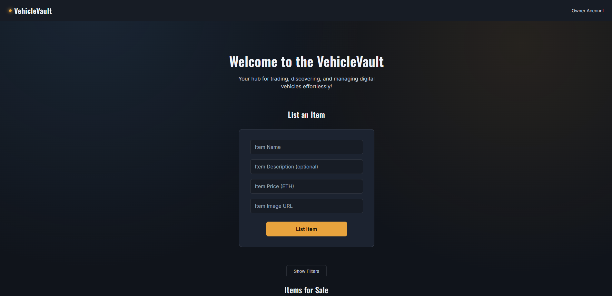

# VehicleVault

VehicleVault is a decentralized marketplace for listing, purchasing, and transferring vehicles as on-chain assets. All listing, sale, and ownership-transfer logic is enforced by a Solidity smart contract, ensuring transparent and tamper-resistant transaction records. The frontend serves solely as a client interface to the underlying contract.



## Overview

- **Wallet Integration** — Establishes a secure connection to a blockchain wallet (e.g., MetaMask) for transaction signing and identity verification.
- **Vehicle Listing** — Enables users to publish a vehicle to the marketplace with a name, description, price in ETH, and image.
- **Marketplace Browsing** — Displays every active listing along with its price and current owner.
- **Listing Filters** — Narrows visible listings by name or price range.
- **Purchasing** — Allows any listed item not already owned by the connected wallet to be bought directly through the contract, with payment settled in ETH.
- **Ownership Management** — Provides a dedicated view of owned assets, with the ability to transfer any item to another wallet address.

## Technology Stack

- **Frontend:** React
- **Blockchain Interaction:** ethers.js
- **Smart Contract:** Solidity
- **Styling:** CSS

## Prerequisites

Ensure the following are available in your development environment:

- Node.js and npm
- A browser-based Ethereum wallet (MetaMask or equivalent)
- A deployed instance of the marketplace smart contract on an Ethereum-compatible network

The contract must expose the following interface: `listItem`, `purchaseItem`, `transferItem`, `items`, `itemCount`, `getItemsByOwner`, and `owner`.

## Installation

**1. Clone the repository**

```bash
git clone https://github.com/<your-username>/vehiclevault.git
cd vehiclevault
```

**2. Install dependencies**

```bash
npm install
```

**3. Configure the contract connection**

Duplicate the example environment file and populate it with your deployed contract's address. This ensures sensitive deployment details remain outside of version control.

```bash
cp .env.example .env
```

Then set the following variable in `.env`:

```
REACT_APP_CONTRACT_ADDRESS=0xYourDeployedContractAddressHere
```

**4. Launch the application**

```bash
npm start
```

The application will be accessible at `http://localhost:3000`. On load, MetaMask will prompt for wallet connection; ensure your wallet is set to the same network as the deployed contract.

## Usage

**Wallet connection** — Approve the connection request in your wallet extension upon page load. Your connected address is displayed in the top-right corner; if it matches the contract deployer's address, the interface will indicate "Owner Account" status.

**Listing a vehicle** — Complete the form at the top of the page (name, optional description, price in ETH, and image URL), then submit via **List Item**. This action initiates an on-chain transaction and requires wallet confirmation.

**Purchasing a vehicle** — Every card under *Items for Sale* that isn't already owned by the connected wallet displays a **Purchase** button. Selecting it sends the listed price in ETH to the seller through the contract.

**Transferring ownership** — Under *Your Own Items*, enter the recipient's wallet address on the relevant item's card and select **Transfer**.

**Filtering listings** — Select **Show Filters** to reveal a price range slider and a name search field; **Clear Filters** resets both.

## Project Structure

```
src/
├── App.js       # Core component logic and contract interaction
├── App.css      # Application styling
└── index.js     # React DOM rendering entry point
```

## Smart Contract Interface

The application interacts with a Solidity contract responsible for managing vehicle listings, sales, and ownership records on-chain. Key methods include:

- **`listItem(...)`** — Publishes a new vehicle listing to the marketplace under the caller's address.
- **`purchaseItem(uint itemId)`** — Transfers ownership of the specified item to the buyer in exchange for the listed ETH price.
- **`transferItem(uint itemId, address newOwner)`** — Reassigns ownership of an owned item to a specified recipient address.
- **`getItemsByOwner(address owner)`** — Returns all items currently owned by the specified address.
- **`items` / `itemCount`** — Expose the full set of listings and the total number of items recorded by the contract.
- **`owner()`** — Returns the address designated as the contract owner.

## Security Considerations

- Never commit a `.env` file or hardcode private keys within the project. `.env` is included in `.gitignore` by default — this configuration should not be altered.
- Ownership and transaction history recorded through this application are persisted on a public, immutable ledger. Treat listing details and wallet addresses accordingly.
- Access control is enforced at the smart contract level; frontend validation alone should not be relied upon for security guarantees.

## License

Distributed under the MIT License. Refer to the `LICENSE` file for full terms.